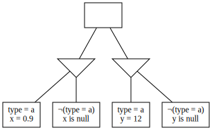
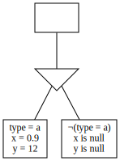

# Developer Guide


## Development

1. [Contributing](#Contributing)
1. [Building](#building)
1. [Testing](#testing)
1. [Bugs And Issues](#bugs-and-issues)
1. [Adding Schema Versions](#Adding-Schema-Versions)
1. [Frameworks](#frameworks)
1. [Git Merging](#Git-Merging)


## Key Concepts

1. [Design Decisions](#key-decisions)
1. [Decision Trees](#decision-trees)
    1. [Example](#example)
    1. [Derivation](#derivation)
    1. [Optimisation](#optimisation)
1. [Profile Syntax](#profile-syntax)
1. [Behaviour in Detail](#behaviour-in-detail)
    1. [Nullness](#nullness)
    1. [Type Implication](#Type-Implication)
    1. [Violation of Rules](#Violation-of-Rules)
    1. [General Strategy for Violation](#General-Strategy-for-Violation)
    1. [Null Operator](#Null-Operator)
    1. [Null Operator with If](#Null-Operator-with-If)

## Algorithms and Data Structures

1. [Generation Algorithm](#decision-tree-generation)
    1. [Decision tree interpretation](#Decision-tree-interpretation)
    1. [Constraint reduction](#Constraint-reduction)
    1. [Databags](#Databags)
    1. [Output](#output)
1. [Field Fixing Strategy](#Field-Fixing-strategies)
1. [String Generation](#String-Generation)
1. [Tree Walker Types](#Tree-walker-types)

Unsure:

1. [Cucumber cheat sheet](#Cucumber-cheat-sheet)


# Contributing

1. Fork it (<https://github.com/yourname/yourproject/fork>)
2. Create your feature branch (`git checkout -b feature/fooBar`)
3. Read our [contribution guidelines](.github/CONTRIBUTING.md) and [Community Code of Conduct](https://www.finos.org/code-of-conduct)
4. Commit your changes using our [Commit Guidelines](.github/CONTRIBUTING.md#commit-and-pr-messages)
5. Push to the branch (`git push origin feature/fooBar`)
6. Create a new Pull Request

_NOTE:_ Commits and pull requests to FINOS repositories will only be accepted from those contributors with an active, executed Individual Contributor License Agreement (ICLA) with FINOS OR who are covered under an existing and active Corporate Contribution License Agreement (CCLA) executed with FINOS. Commits from individuals not covered under an ICLA or CCLA will be flagged and blocked by the FINOS Clabot tool. Please note that some CCLAs require individuals/employees to be explicitly named on the CCLA.

*Need an ICLA? Unsure if you are covered under an existing CCLA? Email [help@finos.org](mailto:help@finos.org)*

# Building And Testing

DataHelix uses Java 1.8 which can be downloaded from this [link](http://www.oracle.com/technetwork/java/javase/downloads/jdk8-downloads-2133151.html)

DataHelix uses [gradle](https://gradle.org/) to automate the build and test process. To build the project run `gradle build` from the root folder of the project. If it was successful then the created jar file can be found in _orchestrator/build/libs/generator.jar_ .

DataHelix uses cucumber for behaviour driven development and testing, with [gherkin](https://docs.cucumber.io/gherkin/)-based tests. To run the tests for DataHelix run `gradle test` from the root folder of the project.

Below is an example of a cucumber test:

```gherkin
Feature: the name of my feature

  Background:
    Given the generation strategy is interesting
    And there is a field foo

  Scenario: Running the generator should emit the correct data
    Given foo is equal to 8
    Then the following data should be generated:
      | foo  |
      | 8    |
      | null |
```

More examples can be seen in the [generator cucumber features](https://github.com/finos/datahelix/tree/master/orchestrator/src/test/java/com/scottlogic/deg/orchestrator/cucumber)

The framework supports setting configuration settings for the generator, defining the profile and describing the expected outcome. All of these are described below, all variable elements (e.g. `{generationStrategy}` are case insensitive), all fields and values **are case sensitive**.

# Bugs and Issues

Raising well structured and detailed bug reports will be hugely valuable to maturing the DataHelix.

Checklist before raising an issue:
* [ ] Have you [searched for duplicates](https://github.com/finos/datahelix/issues?utf8=%E2%9C%93&q=)?  A simple search for exception error messages or a summary of the unexpected behaviour should suffice.
* [ ] Are you running the latest version?
* [ ] Are you sure this is a bug or missing capability?
* [ ] Have you managed to isolate the issue to a simple profile or test case?

## Raising an Issue
* Create your issue [here](https://github.com/finos/datahelix/issues/new).
* New issues contain two templates in the description: bug report and enhancement request. Please pick the most appropriate for your issue, **then delete the other**.
  * Please also tag the new issue with either "Bug" or "Enhancement".
* Please use [Markdown formatting](https://help.github.com/categories/writing-on-github/)
liberally to assist in readability.
  * [Code fences](https://help.github.com/articles/creating-and-highlighting-code-blocks/) for exception stack traces and log entries, for example, massively improve readability.

# Adding Schema Versions

1. Copy a package in _profile/src/main/resources/profileschema/_ and rename to the new version number.
1. Change the _schemaVersion_ const from the old version number to the new one.

### Example
If the file structure currently looks like the below...
```
- profileschema
     |- 0.1
         |- datahelix.schema.json
```
...and the new version is 0.2 then change it to the following:
```
- profileschema
     |- 0.1
         |- datahelix.schema.json
     |- 0.2
         |- datahelix.schema.json
```

Then change the below (in the new file)...
```
...
"schemaVersion": {
  "title": "The version of the DataHelix profile schema",
  "const": "0.1"
},
...
``` 
...to this:
```
...
"schemaVersion": {
  "title": "The version of the DataHelix profile schema",
  "const": "0.2"
},
...
```

You will need to update the test in _ProfileSchemaImmutabilityTests_ to contain the new schema version generated. Old versions should **not** be modified. This is reflected by the test failing if any existing schemas are modified.

If you experience any issues with this test not updating the schema in IntelliJ, it is recommended to invalidate the cache and restart, or to delete the _profile/out_ directory and rebuild. 


# Frameworks

## used in the project???
Don't know if we need this section really

- We are using [Guice](https://github.com/google/guice) for Dependency Injection (DI)
- We use cucumber for behaviour driven development and testing, with [gherkin](https://docs.cucumber.io/gherkin/)


# Git Merging

TODO - Do we really need this bit?

Assuming you've been developing a feature on the `feature` branch, but `master` has changed since you started work.

This is depicted below:
```
- - - master
  |
  | - - feature
```

To make a Pull Request, you will first need to merge `master` into `feature`.

First, ensure that the local master is up to date. Then, checkout the `feature` branch.

If in doubt, `git merge master` then `git push` will work.

If you don't want to have merge commits, you can rebase using `git rebase master` and push with `git push --force-with-lease`.

Make sure you don't `git pull` between the rebase and the push because it can cause changes to be merged incorrectly. 


# Key decisions

## Do type-specific constraints imply corresponding type constraints?

For instance, what is generated for the price field in this example?

```javascript
{ "field": "price", "is": "greaterThan", "value": 4 }
```

This constraint means :
  * Everything except numbers less than or equal to 4 (eg, strings are valid). Users are expected to supplement with type constraints


## Does negating a constraint complement its denotation?

In other words, given a constraint `C`, is `¬C` satisfied by everything that doesn't satisfy `C`?

In some cases this is intuitive:

- If `C` says that a field is null, `¬C` should permit that field to be anything _other_ than null.
- If `C` says that a field is in a set, `¬C` should permit anything _not_ in that set.
- If `C` says that a field is a decimal, `¬C` should permit strings, datetimes, etc.

But:

- If `C` says that a field is a number greater than 3, it might be intuitive to say that `¬C` permits numbers less than or equal to 3.     

Note that negation of type integer is not fully defined yet as we do not have a negation of granularTo implemented.

## Does an inSet constraint imply anything about nullability?

```javascript
{ "field": "product_type", "is": "inSet", "values": [ "a", "b" ] }
```

Given the above, should we expect nulls? If null is considered a _value_ then no would be a reasonable answer, but it can equally be considered the absence of a value. 

## What do datetime constraints mean when datetimes are partially specified?

```javascript
{ "field": "creationDate", "is": "after", "value": "2015-01-01" }
```

Should I be able to express the above, and if so what does it mean? Intuitive, we might say that it cannot be satisfied with, eg, `2015-01-01 12:00:00`, but it depends on how we interpret underspecified datetimes:

* As an **instant**? If so, `2015-01-01` is interpreted as `2015-01-01 00:00:00.000`, and even a datetime 0.01 milliseconds later would satisfy the above constraint.
* As a **range**? If so, `2015-01-01` is interpreted as `2015-01-01 00:00:00.000 ≤ X < 2015-01-02 00:00:00.000`, and the `before` and `after` constraints are interpreted relative to the start and end of this range, respectively.

Both of these approaches seem more or less intuitive in different cases (for example, how should `equalTo` constraints be applied?). To resolve this problem, we currently require datetime expressions to be fully specified down to thousandths of milliseconds.

## How should we generate characters outside the basic latin character set?

We currently only support generation of characters represented in range 002c-007e.

Either we can:
1) Update the tool to reject any regular expressions that contain characters outside of this range.
2) Update the tool to accept & generate these characters

## Is the order of rows emitted between each run consistent?

We currently do not guarantee that the order of valid rows is consistent between each generation run. For example on one execution we may produce the following output for three fields:

| Field A | Field B | Field C |
|---------|---------|---------|
| 1       | Z       | 100.5   |
| 1       | Z       | 95.2    |
| 2       | Z       | 100.5   |
| 2       | Z       | 95.2    |
| 1       | Y       | 100.5   |
| 1       | Y       | 95.2    |

However on another using the same profile we may produce the following output:

| Field A | Field B | Field C |
|---------|---------|---------|
| 1       | Z       | 100.5   |
| 1       | Z       | 95.2    |
| 1       | Y       | 100.5   |
| 1       | Y       | 95.2    |
| 2       | Z       | 100.5   |
| 2       | Z       | 95.2    |

Both produce valid output and both produce the same values as a whole but in slightly different order.

# Decision Trees

**Decision Trees** contain **Constraint Nodes** and **Decision Nodes**:

* Constraint Nodes contain atomic constraints and a set of decision nodes, and are satisfied by an data entry if it satifies all atomic constraints and decision nodes.
* Decision Nodes contain Constraint Nodes, and are satisfied if at least one Constraint Node is satisfied.

Every Decision Tree is rooted by a single Constraint Node.

## Example

In our visualisations, we notate constraint nodes with rectangles and decision nodes with triangles.


## Derivation

Given a set of input constraints, we can build an equivalent Decision Tree.

One process involved in this is **constraint normalisation**, which transforms a set of constraints into a new set with equivalent meaning but simpler structure. This happens through repeated application of some known equivalences, each of which consumes one constraint and outputs a set of replacements:

| Input              | Outputs                       |
| ------------------ | ----------------------------- |
| `¬¬X`              | `X`                           |
| `AND(X, Y)`        | `X, Y`                        |
| `¬OR(X, Y, ...)`   | `¬X, ¬Y, ...`                 |
| `¬AND(X, Y, ...)`  | `OR(¬X, ¬Y, ...)`             |
| `¬IF(X, Y)`        | `X, ¬Y`                       |
| `¬IFELSE(X, Y, Z)` | `OR(AND(X, ¬Y), AND(¬X, ¬Z))` | 

We can convert a set of constraints to a Constraint Node as follows:

1. Normalise the set of constraints
2. Take each constraint in sequence:
    * If the constraint is atomic, add it to the Constraint Node
    * If the constraint is an `OR`, add a Decision Node. Convert the operands of the `OR` into Constraint Nodes
    * If the constraint is an `IF(X, Y)`, add a Decision Node with two Constraint Nodes. One is converted from `AND(X, Y)`, the other from `¬X`
    * If the constraint is an `IFELSE(X, Y, Z)`, add a Decision Node with two Constraint Nodes. One is converted from `AND(X, Y)`, the other from `AND(¬X, Z)`


## Optimisation

As a post-processing step, we apply optimisations to yield equivalent but more tractable trees.

### Partitioning

The expression of a field may depend on the expression of other fields. For instance, given `X = 3 OR Y = 5`, `Y` must be `5` if `X` is not `3`; `X` and `Y` can be said to _co-vary_. This covariance property is transitive; if `X` and `Y` co-vary and `Y` and `Z` co-vary, then `X` and `Z` also co-vary. Given this definition, it's usually possible to divide a profile's fields into smaller groups of fields that co-vary. This process is called **partitioning**.

For example, given the below tree:


We can observe that variations in `x` and `y` have no implications on one another, and divide into two trees:

 

The motivation for partitioning is to determine which fields can vary independently of each other so that streams of values can be generated for them independently (and potentially in parallel execution threads) and then recombined by any preferred [combination strategy](docs/user/CombinationStrategies.md).

### Unification

Consider the below tree:



It's impossible to [partition](#Partitioning) this tree because the `type` field affects every decision node. However, we can see that the below tree is equivalent:  



Formally: If you can identify pairs of sibling, equivalent-valency decision nodes A and B such that for each constraint node in A, there is precisely one mutually satisfiable node in B, you can collapse the decisions. There may be multiple ways to do this; the ordering of combinations affects how extensively the tree can be reduced.

### Deletion

Consider the below tree:


Because the leftmost node contradicts the root node, we can delete it. Thereafter, we can pull the content of the other constraint node up to the root node. However, because `¬(x > 12)` is entailed by `x = 3`, we delete it as well. This yields:


### Hoisting

Consider the below tree:


We can simplify to:


Formally: If a Decision Node `D` contains a Constraint Node `C` with no constraints and a single Decision Node `E`, `E`'s Constraint Nodes can be added to `D` and `C` removed.

This optimisation addresses situations where, for example, an `anyOf` constraint is nested directly inside another `anyOf` constraint.

# Profile Syntax

TODO - Do we need this in the developer guide. should be in user.

## Sample file
```javascript
{
	"schemaVersion": "0.1",
	"description": "A dataset about financial products",
	"fields":
	[
		{ "name": "id" },
		{ "name": "time" },
		{ "name": "country" },
		{ "name": "tariff" },
		{ "name": "low_price" },
		{ "name": "high_price" }
	],
	"rules":
	[
		{
			"rule": "id is a non-nullable string",
			"constraints":
			[
				{ "field": "id", "is": "ofType", "value": "string" },
				{ "not": { "field": "id", "is": "null" } }
			]
		},

		{
			"rule": "low_price is a non-nullable positive integer",
			"constraints": [
				{ "field": "low_price", "is": "ofType", "value": "integer" },
				{ "not": { "field": "low_price", "is": "null" } },
				{ "field": "low_price", "is": "greaterThanOrEqualTo", "value": 0 }
			]
		},
		{ 
			"rule": "allowed countries",
			"constraints": [
				{ "field": "country", "is": "inSet", "values": [ "USA", "GB", "FRANCE" ] }
			]
		},
		{
			"rule": "country tariffs",
			"constraints": [
				{
					"if": {
						"anyOf": [
							{ "field": "country", "is": "equalTo", "value": "USA" },
							{ "field": "country", "is": "null" }
						]
					},
					"then": {
						"allOf": [
							{ "field": "tariff", "is": "null" },
							{ "field": "time", "is": "after", "value": { "date": "2014-01-01" } }
						]
					},
					"else": { "not": { "field": "tariff", "is": "null" } }
				}
			]
		}
	]
}
```

## Constituent objects

### `Profile`
* `"description"`: An optional description of what data the profile is modelling.
* `"fields"`: A set of one or more `Field` objects. Each field must have a unique name.
* `"rules"`: A set of one or more `Rule` objects which must contain one or more `Constraint` objects.

### `Field`

A field in the data set.

* `"name"`: The field's name. Should be unique, as constraints will reference fields by name. This property is used for, eg, column headers in CSV output

### `Rule`
A named collection of constraints. Test case generation revolves around rules, in that the generator will output a separate dataset for each rule, wherein each row violates the rule in a different way.

* `"rule"`: A textual description of the rule
* `"constraints"`: A set of constraints composing this rule

### `Constraint`

One of:

- a [predicate constraint](UserGuide.md#Predicate-constraints)
- a [grammatical constraint](UserGuide.md#Grammatical-constraints)
- a [presentational constraint](UserGuide.md#Presentational-constraints)


The Profile schema format is formally documented in the [User Guide](UserGuide.md).


# Behaviour in Detail
## Nullness
### Behaviour
Nulls can always be produced for a field, except when a field is explicitly not null. 

### Misleading Examples
|Field is               |Null produced|
|:----------------------|:-----------:|
|Of type X              | ✔ |
|Not of type X          | ✔ |
|In set [X, Y, ...]     | ✔ |
|Not in set [X, Y, ...] | ✔ |
|Equal to X             | ❌ |
|Not equal to X         | ✔ |
|Greater than X         | ✔ |
|Null                   | ✔ |
|Not null               | ❌ |

For the profile snippet:
```
{ "if":
    { "field": "A", "is": "equalTo", "value": 1 },
  "then":
    { "field": "B", "is": "equalTo", "value": 2 }
},
{ "field": "A", "is": "equalTo", "value": 1 }
```

|Allowed value of A|Allowed value of B|
|------------------|------------------|
|1                 |2                 |

## Type Implication
### Behaviour
No operators imply type (except ofType ones). By default, all values are allowed.

### Misleading Examples
Field is greater than number X:

|Values                |Can be produced|
|----------------------|:-------------:|
|Numbers greater than X|✔ |
|Numbers less than X   |❌ |
|Null                  |✔ |
|Strings               |✔ |
|Date-times            |✔ |

## Violation of Rules
### Behaviour
Rules, constraints and top level `allOf`s are all equivalent in normal generation.

In violation mode (an _alpha feature_), rules are treated as blocks of violation.
For each rule, a file is generated containing data that can be generated by combining the
violation of that rule with the non-violated other rules.

This is equivalent to the behaviour for constraints and `allOf`s, but just splitting it into different files.

## General Strategy for Violation
_This is an alpha feature. Please do not rely on it. If you find issues with it, please [report them](https://github.com/finos/datahelix/issues)._ 
### Behaviour
The violation output is not guaranteed to be able to produce any data,
even when the negation of the entire profile could produce data.

### Why
The violation output could have been calculated by simply negating an entire rule or profile. This could then produce all data that breaks the original profile in any way. However, this includes data that breaks the data in multiple ways at once. This could be very noisy, because the user is expected to test one small breakage in a localised area at a time.

To minimise the noise in an efficient way, a guarantee of completeness is broken. The system does not guarantee to be able to produce violating data in all cases where there could be data which meets this requirement. In some cases this means that no data is produced at all.

In normal negation, negating `allOf [A, B, C]` gives any of the following:
1) `allOf[NOT(A), B, C]`
2) `allOf[A, NOT(B), C]`
3) `allOf[A, B, NOT(C)]`
4) `allOf[NOT(A), NOT(B), C]`
5) `allOf[A, NOT(B), NOT(C)]`
6) `allOf[NOT(A), B, NOT(C)]`
7) `allOf[NOT(A), NOT(B), NOT(C)]`

These are listed from the least to most noisy. The current system only tries to generate data by negating one sub-constraint at a time (in this case, producing only 1, 2 and 3).

### Misleading examples
When a field is a string, an integer and not null, no data can be produced normally,
but data can be produced in violation mode.

|Values                |Can be produced when in violation mode|
|----------------------|:-------------------------------------|
|Null                  |✔ (By violating the "not null" constraint) |
|Numbers               |✔ (By violating the "string" constraint) |
|Strings               |✔ (By violating the "integer" constraint) |
|Date-times            |❌ (This would need both the "string" and "integer" constraints to be violated at the same time) |

If a field is set to null twice, no data can be produced in violation mode because it tries to evaluate null and not null:

|Values                |Can be produced when in violation mode|
|----------------------|:-------------------------------------|
|Null                  |❌|
|Numbers               |❌|
|Strings               |❌|
|Date-times            |❌|


## Null Operator

The `null` operator in a profile, expressed as `"is": "null"` or the negated equivalent has several meanings. It can mean (and emit the behaviour) as described below:

### Possible scenarios:

| Absence / Presence | Field value |
| ---- | ---- |
| (A) _null operator omitted_<br /> **The default**. The field's value may be absent or present | (B) `is null`<br />The field will have _no value_ |
| (C) `not(is null)`<br />The field's value must be present | (D) `not(is null)`<br />The field must have a value |

Therefore the null operator can:
- (C, D) `not(is null)` express fields that must have a value (otherwise known as a non-nullable field)
- (B) `is null` express fields as having no value (otherwise known as setting the value to `null`)
- (A) _By omitting the constraint_: express fields as permitting absence or presence of a value (otherwise known as a nullable field)

### `null` and interoperability
`null` is a keyword/term that exists in other technologies and languages, so far as this tool is concerned it relates to the absence or the presence of a value. See [set restriction and generation](docs/user/SetRestrictionAndGeneration.md) for more details.

When a field is serialised or otherwise written to a medium, as the output of the generator, it may choose to represent the absence of a value by using the formats' `null` representation, or some other form such as omitting the property and so on.

#### For illustration
CSV files do not have any standard for representing the absence of a value differently to an empty string (unless all strings are always wrapped in quotes ([#441](https://github.com/ScottLogic/data-engineering-generator/pull/441)). 

JSON files could be presented with `null` as the value for a property or excluding the property from the serialised result. This is the responsibility of the serialiser, and depends on the use cases.

## Null Operator with If
With `if` constraints, the absence of a value needs to be considered in order to understand how the generator will behave. Remember, every set contains the empty set, unless excluded by way of the `not(is null)` constraint, for more details see [set restriction and generation](docs/user/SetRestrictionAndGeneration.md).

Consider the following if constraint:

```
{
    "if": {
        {
            "field": "field1",
            "is": "equalTo",
            "value": 5
        }
    },
    "then": {
        {
            "field": "field2",
            "is": "equalTo",
            "value": "a"
        }
    }
}
```

The generator will expand the `if` constraint as follows, to ensure the constraint is fully balanced:

```
{
    "if": {
        {
            "field": "field1",
            "is": "equalTo",
            "value": 5
        }
    },
    "then": {
        {
            "field": "field2",
            "is": "equalTo",
            "value": "a"
        }
    },
    "else": {
        {
            "not": {
                "field": "field1",
                "is": "equalTo",
                "value": 5
            }
        }
    }
}
```

This expression does not prevent the consequence (the `then` constraints) from being considered when `field1` has no value. Equally it does not say anything about the alternative consequence (the `else` constraints). As such both outcomes are applicable at any time.

The solution to this is to express the `if` constraint as follows. This is not 'auto completed' for profiles as it would remove functionality that may be intended, it must be explicitly included in the profile.

```
{
    "if": {
        "allOf": [
            {
                "field": "field1",
                "is": "equalTo",
                "value": 5
            },
            {
                "not": {
                    "field": "field1",
                    "is": "null"
                }
            }
        ]
    },
    "then": {
        {
            "field": "field2",
            "is": "equalTo",
            "value": "a"
        }
    }
}
```

The generator will expand the `if` constraint as follows, to ensure the constraint is fully balanced:

```
{
    "if": {
        "allOf": [
            {
                "field": "field1",
                "is": "equalTo",
                "value": 5
            },
            {
                "not": {
                    "field": "field1",
                    "is": "null"
                }
            }
        ]
    },
    "then": {
        {
            "field": "field2",
            "is": "equalTo",
            "value": "a"
        }
    },
    "else": {
        "anyOf": [
            {
                "not": {
                    "field": "field1",
                    "is": "equalTo",
                    "value": 5
                }
            },
            {
                "field": "field1",
                "is": "null"
            }
        ]
    }
}
```

In this case the `then` constraints will only be applicable when `field1` has a value. Where `field1` has no value, either of the `else` constraints can be considered applicable. Nevertheless `field2` will only have the value `"a"` when `field1` has the value `5`, not when it is absent also.

### Examples:
Considering this use case, you're trying to generate data to be imported into a SQL server database. Below are some examples of constraints that may help define fields and their mandatoriness or optionality.

* A field that is non-nullable<br />
`field1 ofType string and field1 not(is null)`

* A field that is nullable<br />
`field1 ofType string`

* A field that has no value<br />
`field1 is null`

## Violations
Violations are a special case for the `null` operator, see [Deliberate Violation](docs/user/alphaFeatures/DeliberateViolation.md) for more details.

# Decision tree generation

Given a set of rules, generate a [decision tree](#decision-trees) (or multiple if [partitioning](#partitioning) was successful).

## Decision tree interpretation

An interpretation of the decision tree is defined by chosing an option for every decision visited in the tree.


In the above diagram the red lines represent one interpretation of the graph, for every decision an option has been chosen and we end up with the set of constraints that the red lines touch at any point. These constraints are reduced into a fieldspec (see [Constraint Reduction](#constraint-reduction) below).

Every decision introduces new interpretations, and we provide interpretations of every option of every decision chosen with every option of every other option. If there are many decisons then this can result in too many interpretations.

## Constraint reduction

An interpretation of a decision tree could contain several atomic constraints related to a single field. To make it easier to reason about these collectively, we **reduce** them into more detailed, holistic objects. These objects are referred to as **fieldspecs**, and can express any restrictions expressed by a constraint. For instance, the constraints:

* `X greaterThanOrEqualTo 3`
* `X lessThanEqualTo 6`
* `X not null`

could collapse to

```
{
  min: 3,
  max: 6,
  nullability: not_null
}
```

*(note: this is a conceptual example and not a reflection of actual object structure)* 

See [Set restriction and generation](docs/user/SetRestrictionAndGeneration.md) for a more in depth explanation of how the constraints are merged and data generated.

This object has all the information needed to produce the values `[3, 4, 5, 6]`.

The reduction algorithm works by converting each constraint into a corresponding, sparsely-populated fieldspec, and then merging them together. During merging, three outcomes are possible:

* The two fieldspecs specify distinct, compatible restrictions (eg, `X is not null` and `X > 3`), and the merge is uneventful
* The two fieldspecs specify overlapping but compatible restrictions (eg, `X is in [2, 3, 8]` and `X is in [0, 2, 3]`), and the more restrictive interpretation is chosen (eg, `X is in [2, 3]`).
* The two fieldspecs specify overlapping but incompatible restrictions (eg, `X > 2` and `X < 2`), the merge fails and the interpretation of the decision tree is rejected

## Databags

A **databag** is an immutable mapping from fields to outputs, where outputs are a pairing of a *value* and *formatting information* (eg, a date formatting string or a number of decimal places).

Databags can be merged, but merging two databags fails if they have any keys in common.

Fieldspecs are able to produce streams of databags containing valid values for the field they describe. Additional operations can then be applied over these streams, such as:

* A memoization decorator that records values being output so they can be replayed inexpensively
* A filtering decorator that prevents repeated values being output
* A merger that takes multiple streams and applies one of the available [combination strategies](docs/user/CombinationStrategies.md)
* A concatenator that takes multiple streams and outputs all the members of each

## Output

Once fieldspecs have generated streams of single-field databags, and databag stream combiners have merged them together, we should have a stream of databags that each contains all the information needed for a single datum. At this point, a serialiser can take each databag in turn and create an output.

To create a row the serialiser iterates through the fields in the profile, in order, and uses the field as a lookup for the values in the databag.

CSV and JSON formats are currently supported.

# Field Fixing strategies

The generator in 'reductive' mode can be said to operate in the following way:
1. Pick a field
2. Fix that field's value
3. Eliminate any options that cannot be generated based on this value
4. Repeat until all fields are fixed with values

One area that _could_ affect performance is the order in which we pick fields to fix values. The way in which we determine this order is known as a **fix field strategy**.

Our current default is the **hierarchical dependency** strategy.

## Hierarchical Dependency

This strategy picks fields to fix using a combination of factors. It sorts a list of fields into an order as follows: 
- **First** favour picking fields that are **not dependent** on other fields
- **Then**  favour picking fields that **constrain** other fields
- **Then** use the [set based strategy](#set-based)
- **Then** compare fields alphabetically by name

If a field is **independent** of any other fields they can _co-vary_. This means that the field's value cannot cause another fields value to contradict.

Overall this strategy assumes some **hierarchical** categorisation of fields where we attempt to pick the most **constraining** fields first. 

The idea behind this is that:
- The field picked **reduces** the other fields remaining possible values 
- The field picked is known to be less dependent than other fields and should be less likely to require backtracking

### Examples
Consider the following statements:
- There are 4 fields in a profile A, B, C and D
- Field B's value is dependent on Field A
- Field C and D's values are dependent on Field B

From this we can also deduce:
> Field C and D are also indirectly dependent on Field A

In this example fields would be picked in the following order:
1. A
2. B
3. C
4. D

#### Explanation
- A is picked first as it has no dependencies on other fields, but directly constrains B and indirectly constrains C and D
- B is picked next as it constrains C and D, but is dependent upon A
- Neither C and D constrain any other field and are both constrained equally by B. Therefore C is only chosen over D because of alphabetical ordering 

## Set Based

This strategy picks fields based on the following:
 - **First** favour picking fields that are always **constrained** by a finite set
 - **Then**  favour picking fields where the sets are smaller
 
Currently this is also used as a further step within the Hierarchical Dependency strategy
 
## Ranked Constraint
 
This strategy does the following:
1. Get all the atomic constraints in the tree and group them by field
2. Score each constraint by it's precision (e.g. an equalTo is precise, a set of 2 values is half as precise)
3. Sort the fields by score into a ranking
4. Pick the field with the highest rank (greatest precision)

This differs in implementation to the above strategies in that it is **tree based** and not **profile based**.

This means two things:
- It runs based on a Decision Tree rather than a Profile object
- It is dynamic and can run multiple times within the generation run time


# String Generation

TODO - this just feels like it is their documentation... although theirs is awful so maybe this has a place

We use a Java library called [dk.brics.automaton](http://www.brics.dk/automaton/) to analyse regexes and generate valid (and invalid for [violation](docs/user/alphaFeatures/DeliberateViolation.md)) strings based on them. It works by representing the regex as a finite state machine. It might be worth reading about state machines for those who aren't familiar: [https://en.wikipedia.org/wiki/Finite-state_machine](https://en.wikipedia.org/wiki/Finite-state_machine). Consider the following regex: `ABC[a-z]?(A|B)`. It would be represented by the following state machine:


The [states](http://www.brics.dk/automaton/doc/index.html) (circular nodes) represent a string that may (green) or may not (white) be valid. For example, `s0` is the empty string, `s5` is `ABCA`.

The [transitions](http://www.brics.dk/automaton/doc/index.html) represent adding another character to the string. The characters allowed by a transition may be a range (as with `[a-z]`). A state does not store the string it represents itself, but is defined by the ordered list of transitions that lead to that state.

Other than the fact that we can use the state machine to generate strings, the main benefit that we get from using this library are:
* Finding the intersection of two regexes, used when there are multiple regex constraints on the same field.
* Finding the complement of a regex, which we use for generating invalid regexes for violation.

Due to the way that the generator computes textual data internally the generation of strings is not deterministic and may output valid values in a different order with each generation run. 

## Anchors

dk.brics.automaton doesn't support start and end anchors `^` & `$` and instead matches the entire word as if the anchors were always present. For some of our use cases though it may be that we want to match the regex in the middle of a string somewhere, so we have two versions of the regex constraint - [matchingRegex](docs/user/UserGuide.md#predicate-matchingregex) and [containingRegex](docs/user/UserGuide.md#predicate-containingregex). If `containingRegex` is used then we simply add a `.*` to the start and end of the regex before passing it into the automaton. Any `^` or `$` characters passed at the start or end of the string respectively are removed, as the automaton will treat them as literal characters.

## Automaton data types
The automaton represents the state machine using the following types:
- `Transition`
- `State`

### `Transition`
A transition holds the following properties and are represented as lines in the above graph
- `min: char` - The minimum permitted character that can be emitted at this position
- `max: char` - The maximum permitted character that can be emitted at this position
- `to: State[]` - The `State`s that can follow this transition

In the above `A` looks like:

| property | initial | \[a-z\] | 
| ---- | ---- | ---- |
| min | A | a |
| max | A | z |
| to | 1 state, `s1` | 1 state, `s4` |

### `State`
A state holds the following properties and are represented as circles in the above graph
- `accept: boolean` - is this a termination state, can string production stop here?
- `transitions: HashSet<Transition>` - which transitions, if any, follow this state
- `number: int` - the number of this state
- `id: int` - the id of this state (not sure what this is used for)

In the above `s0` looks like:

| property | initial | s3 |
| ---- | ---- | ---- |
| accept | false | false |
| transitions | 1 transition, &rarr; `A` | 2 transitions:<br /> &rarr; `[a-z]`<br /> &rarr; `A|B` |
| number | 4 | 0 |
| id | 49 | 50 |

### Textual representation
The automaton can represent the state machine in a textual representation such as:

```
initial state: 4
state 0 [reject]:
  a-z -> 3
  A-B -> 1
state 1 [accept]:
state 2 [reject]:
  B -> 5
state 3 [reject]:
  A-B -> 1
state 4 [reject]:
  A -> 2
state 5 [reject]:
  C -> 0
```

This shows each state and each transition in the automaton, lines 2-4 show the `State` as shown in the previous section.
Lines 10-11 show the transition 'A' as shown in the prior section.

The pathway through the automaton is:
- transition to state **4** (because the initial - empty string state - is rejected/incomplete)
- add an 'A' (state 4)
- transition to state **2** (because the current state "A" is rejected/incomplete)
- add a 'B' (state 2)
- transition to state **5** (because the current state "AB" is rejected/incomplete)
- add a 'C' (state 5)
- transition to state **0** (because the current state "ABC" is rejected/incomplete)
   - _either_
      - add a letter between `a..z` (state 0, transition 1)
      - transition to state **3** (because the current state "ABCa" is rejected/incomplete)
      - add either 'A' or 'B' (state 3)
      - transition to state **1** (because the current state "ABCaA" is rejected/incomplete)
      - current state is accepted so exit with the current string "ABCaA"
   - _or_   
      - add either 'A' or 'B' (state 0, transition 2)
      - transition to state **1** (because the current state "ABCA" is rejected/incomplete)
      - current state is accepted so exit with the current string "ABCA"

## Character support

The generator does not support generating strings above the Basic Unicode plane (Plane 0). Using regexes that match characters above the basic plane may lead to unexpected behaviour.


# Tree walker types

The generator transforms each profile into one or more [decision trees](#Decision-Trees), each of these can then be process through some strategy. The strategies for processing these trees are known as Tree walker types, each must implement `DecisionTreeWalker`.

The following walker strategies exist:

* Decision based (default)
* Cartesian product
* Reductive

## Decision Based
This is a recursive algorithm that selects an option from the decision tree, then reduces the tree for the constraints in that option.

The Decision Based Tree solver generates row specs by:
 1. choosing and removing a decision from the tree
 2. selecting an option from that decision
 3. adding the constraints from the chosen option to the root of the tree
    - adding the sub decisions from the chosen option to the root of the tree
 4. "pruning" the tree by removing any options from the tree that contradict with the new root node
    - any decisions that only have 1 remaining option will have that option also moved up the tree, and pruned again.
 5. restarting from 1, until there are no decision left
 6. creating a rowspec from the constraints in the remaining root node.

## Cartesian product
This strategy is the a recursive algorithm which will 'multiply' each leaf node of the tree against every other leaf node of the decision tree in order to generate data. As such it can create vast numbers of permutations. This strategy makes no attempt to overcome the chance of a combinatorial explosion which can occur with relatively few rules and constraints.

This strategy uses certain methods of the Java Streams API which are known to block rather than be lazy (`flatMap`) which means the data may be prevented from being emitted until all permutations have been calculated.

This strategy is also known to have limited-to-no intelligence when it comes to [contradictions](docs/user/Contradictions.md). The strategy will back track when they are found, but makes no attempt to preemptively check for them or prevent the walker from entering a contradictory path of the tree.

## Reductive
The strategy selects a value for a field, then reduces the size of the problem (the tree) progressively until it cannot be any further (then back-tracking occurs) or sufficient information is known (then row/s can be emitted.)

See [Reductive tree walker](ReductiveTreeWalker.md) for more details.


# Cucumber cheat sheet

### Configuration options
* _the generation strategy is `{generationStrategy}`_ see [generation strategies](https://github.com/finos/datahelix/blob/master/docs/user/generationTypes/GenerationTypes.md) - default: `random`
* _the combination strategy is `{combinationStrategy}`_ see [combination strategies](https://github.com/finos/datahelix/blob/master/docs/user/CombinationStrategies.md) - default: `exhaustive`
* _the walker type is `{walkerType}`_ see [walker types](https://github.com/finos/datahelix/blob/master/docs/developer/decisionTreeWalkers/TreeWalkerTypes.md) - default: `reductive`
* _the data requested is `{generationMode}`_, either `violating` or `validating` - default: `validating`
* _the generator can generate at most `{int}` rows_, ensures that the generator will only emit `int` rows, default: `1000`
* _we do not violate constraint `{operator}`_, prevent this operator from being violated (see **Operators** section below), you can specify this step many times if required

### Defining the profile
It is important to remember that constraints are built up of 3 components: a field, an operator and most commonly an operand. In the following example the operator is 'greaterThan' and the operand is 5.

```
foo is greaterThan 5
```

Operators are converted to English language equivalents for use in cucumber, so 'greaterThan' is expressed as 'greater than'.

* _there is a field `{field}`_, adds a field called `field` to the profile
* _the following fields exist:_, adds a set of fields to the profile (is followed by a single column set of strings, each represents a field name)
* _`{field}` is null_, adds a null constraint to the profile for the field `field`
* _`{field}` is anything but null_, adds a not(is null) constraint to the profile for field `field`
* _`{field}` is `{operator}` `{operand}`_, adds an `operator` constraint to the field `field` with the data `operand`, see **operators** and **operands** sections below
* _`{field}` is anything but `{operator}` `{operand}`_, adds a negated `operator` constraint to the field `field` with the data `operand`, see **operators** and **operands** sections below
* _there is a constraint:_, adds the given JSON block as a constraint as if it was read from the profile file itself. It should only be used where the constraint cannot otherwise be expressed, e.g. for `anyOf`, `allOf` and `if`.
* _the maximum string length is {length}_, sets the maximum length for strings to the _max_ for the given scenario. The default is _200_ (for performance reasons), however in production the limit is _1000_.
* _untyped fields are allowed_, sets the --allow-untyped-fields flag to false - default: flag is true

#### Operators
See [Predicate constraints](docs/user/UserGuide.md#Predicate-constraints), [Grammatical Constraints](docs/user/UserGuide.md#Grammatical-constraints) and [Presentational Constraints](docs/user/UserGuide.md#Presentational-constraints) for details of the constraints.

#### Operands
When specifying the operator/s for a field, ensure to format the value as in the table below:

| data type | example |
| ---- | ---- |
| string | "my value" |
| number | `1.234` |
| datetime | `2001-02-03T04:05:06.000` |
| null | `null` |

datetimes must be expressed as above (i.e. `yyyy-MM-ddTHH:mm:ss.fff`)

#### Examples
* `ofType` &rarr; `Given foo is of type "string"`
* `equalTo` &rarr; `Given foo is equal to 5`
* `inSet` &rarr; 
```
Given foo is in set: 
  | foo |
  | 1   |
  | 2   |
  | 3   |
```
* `not(after 01/02/2003)` &rarr; `Given foo is anything but after 2003-02-01T00:00:00.00`

In addition the following shows how the _there is a constraint_ step can be used:
```
And there is a constraint:
  """
    {
      "if": { "field": "foo", "is": "equalTo", "value": "dddd" },
      "then": { "field": "bar", "is": "equalTo", "value": "4444" },
      "else": { "field": "bar", "is": "shorterThan", "value": 1 }
    }
  """
```

### Describing the outcome
* _the profile is invalid because "`{reason}`"_, executes the generator and asserts that an `InvalidProfileException` or `JsonParseException` was thrown with the message `{reason}`, reason is a regular expression*.
* _no data is created_, executes the generator and asserts that no data was emitted
* _the following data should be generated:_, executes the generator and asserts that no exceptions were thrown and the given data appears in the generated data, no additional data is permitted.
* _the following data should be generated in order:_, executes the generator and asserts that no exceptions were thrown and the given data appears **in the same order** in the generated data, no additional data is permitted.
* _the following data should be included in what is generated:_, executes the generator and asserts that no exceptions were thrown and the given data is present in the generated data (regardless of order)
* _the following data should not be included in what is generated:_, executes the generator and asserts that no exceptions were thrown and the given data is **not** present in the generated data (regardless of order)
* _some data should be generated_, executes the generator and asserts that at least one row of data was emitted
* _{number} of rows of data are generated_, executes the generator and asserts that exactly the given number of rows are generated

\* Because `{reason}` is a regular expression, certain characters will need to be escaped, by including a `\` before them, e.g. `\(`, `\)`, `\[`, `\]`, etc.

### Validating the data in the output

#### DateTime
* _{field} contains datetime data_, executes the generator and asserts that _field_ contains either `null` or datetimes (other types are allowed)
* _{field} contains only datetime data_, executes the generator and asserts that _field_ contains only `null` or datetimes
* _{field} contains anything but datetime data_, executes the generator and asserts that _field_ contains either `null` or data that is not a datetime.
* _{field} contains datetimes between {min} and {max} inclusively_, executes the generator and asserts that _field_ contains either `null` or datetimes between _{min}_ and _{max}_. Does so in an inclusive manner for both min and max.
* _{field} contains datetimes outside {min} and {max}_, executes the generator and asserts that _field_ contains either `null` or datetimes outside _{min}_ and _{max}_.
* _{field} contains datetimes before or at {before}_, executes the generator and asserts that _field_ contains either `null` or datetimes at or before _{before}_
* _{field} contains datetimes after or at {after}_, executes the generator and asserts that _field_ contains either `null` or datetimes at or after _{after}_

#### Numeric
Note these steps work for asserting both integer and decimal data. There are no current steps for asserting general granularity.
* _{field} contains numeric data_, executes the generator and asserts that _field_ contains either `null` or numeric values (other types are allowed)
* _{field} contains only numeric data_, executes the generator and asserts that _field_ contains only `null` or numeric values
* _{field} contains anything but numeric data_, executes the generator and asserts that _field_ contains either `null` or data that is not numeric.
* _{field} contains numeric values between {min} and {max} inclusively_, executes the generator and asserts that _field_ contains either `null` or numeric values between _{min}_ and _{max}_. Does so in an inclusive manner for both min and max.
* _{field} contains numeric values outside {min} and {max}_, executes the generator and asserts that _field_ contains either `null` or numeric values outside _{min}_ and _{max}_.
* _{field} contains numeric values less than or equal to {value}_, executes the generator and asserts that _field_ contains either `null` or numeric values less than or equal to _{value}_
* _{field} contains numeric values greater than or equal to {value}_, executes the generator and asserts that _field_ contains either `null` or numeric values greater than or equal to _{value}_

#### String
* _{field} contains string data_, executes the generator and asserts that _field_ contains either `null` or string values (other types are allowed)
* _{field} contains only string data_, executes the generator and asserts that _field_ contains only `null` or string values
* _{field} contains anything but string data_, executes the generator and asserts that _field_ contains either `null` or data that is not a string.
* _{field} contains strings of length between {min} and {max} inclusively_, executes the generator and asserts that _field_ contains either `null` or strings with lengths between _{min}_ and _{max}_. Does so in an inclusive manner for both min and max.
* _{field} contains strings of length outside {min} and {max}_, executes the generator and asserts that _field_ contains either `null` or strings with lengths outside _{min}_ and _{max}_.
* _{field} contains strings matching /{regex}/_, executes the generator and asserts that _field_ contains either `null` or strings that match the given regular expression.
* _{field} contains anything but strings matching /{regex}/_, executes the generator and asserts that _field_ contains either `null` or strings that do not match the given regular expression.
* _{field} contains strings shorter than or equal to {length}_, executes the generator and asserts that _field_ contains either `null` or string values shorter than or equal to _{length}_
* _{field} contains strings longer than or equal to {length}_, executes the generator and asserts that _field_ contains either `null` or string values longer than or equal to _{length}_


#### Null (absence/presence)
* _{field} contains anything but null_, executes the generator and asserts that _field_ has a value in every row (i.e. no `null`s)

### Cucumber test style guide
* Each test should be specific to one requirement.
* Tests should specify definite expected results rather than using "should include".
* All tables should be padded to the width of the largest item.
* All block-level indentation should be 2 spaces, as below: 

```gherkin
Feature: ...
  ...

  Background:
    Given ...

  Scenario: ...
    Given ...:
      | ... |
      | ... |
      | ... |
    And ...:
      """
      """
    When ...
    Then ... 
    And ...
```