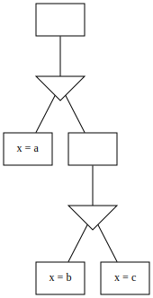
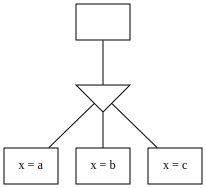

# Decision tree optimisation

## Deletion

Consider the below tree:

Because the leftmost node contradicts the root node, we can delete it. Thereafter, we can pull the content of the other constraint node up to the root node. However, because `¬(x > 12)` is entailed by `x = 3`, we delete it as well. This yields:

## Hoisting

Consider the below tree:

We can simplify to:

Formally: If a Decision Node `D` contains a Constraint Node `C` with no constraints and a single Decision Node `E`, `E`'s Constraint Nodes can be added to `D` and `C` removed.

This optimisation addresses situations where, for example, an `anyOf` constraint is nested directly inside another `anyOf` constraint.
