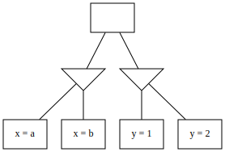
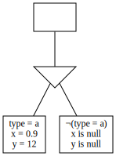
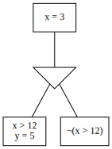
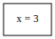
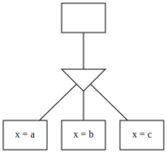
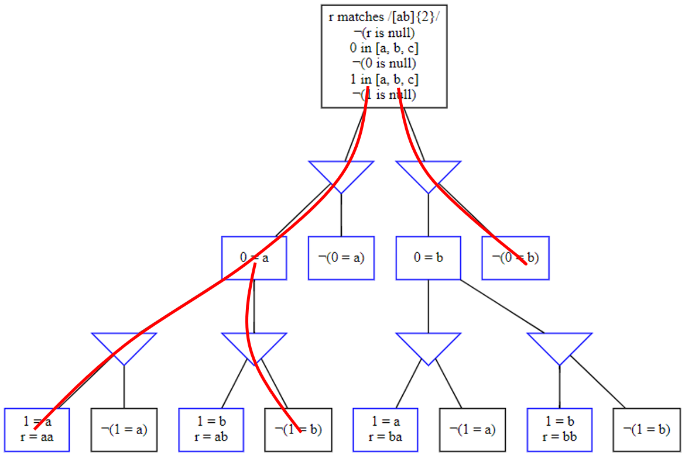
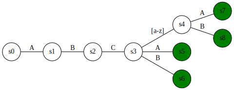

# Table of Contents


1. [Introduction](#introduction)
1. [Development](#Development)

    1. [Bugs And Issues](#bugs-and-issues)
    1. [Building](#Building)
    1. [Testing](#Testing)
    1. [Contributing](#Contributing)
    1. [Adding Schema Versions](#Adding-Schema-Versions)


1. [Algorithms and Data Structures](#Algorithms-and-Data-Structures)

    1. [Decision Trees](#decision-trees)
        1. [Example](#decision-trees-example)
        1. [Derivation](#derivation)
        1. [Optimisation](#optimisation)
    1. [Generation Algorithm](#decision-tree-generation)
        1. [Decision tree interpretation](#Decision-tree-interpretation)
        1. [Constraint reduction](#Constraint-reduction)
        1. [Databags](#Databags)
        1. [Output](#output)
    1. [String Generation](#String-Generation)
    1. [Tree Walking Algorithm](#Tree-Walking-Algorithm)

1. [Behaviour in Detail](Behaviour-in-Detail)

    1. [Null Operator](#Null-Operator)
    1. [Null Operator with If](#Null-Operator-with-If)
    1. [Nullness](#nullness)
    1. [Type Implication](#Type-Implication)

# Introduction

This guide outlines how to contribute to the project as well as the key concepts and structure of the DataHelix. 

* For information on how to get started with DataHelix see our [Getting Started guide](GettingStarted.md)

* For information on the syntax of the DataHelix schema see the [User Guide](UserGuide.md)

# Development

## Bugs and Issues

Raising well structured and detailed bug reports will be hugely valuable to maturing the DataHelix.

Checklist before raising an issue:
* [ ] Have you [searched for duplicates](https://github.com/finos/datahelix/issues?utf8=%E2%9C%93&q=)?  A simple search for exception error messages or a summary of the unexpected behaviour should suffice.
* [ ] Are you running the latest version?
* [ ] Are you sure this is a bug or missing capability?
* [ ] Have you managed to isolate the issue to a simple profile or test case?

### Raising an Issue
* Create your issue [here](https://github.com/finos/datahelix/issues/new).
* New issues contain two templates in the description: bug report and enhancement request. Please pick the most appropriate for your issue, **then delete the other**.
  * Please also tag the new issue with either "Bug" or "Enhancement".
* Please use [Markdown formatting](https://help.github.com/categories/writing-on-github/)
liberally to assist in readability.
  * [Code fences](https://help.github.com/articles/creating-and-highlighting-code-blocks/) for exception stack traces and log entries, for example, massively improve readability.

## Building

DataHelix uses Java 1.8 which can be downloaded from this [link](http://www.oracle.com/technetwork/java/javase/downloads/jdk8-downloads-2133151.html)

DataHelix uses [gradle](https://gradle.org/) to automate the build and test process. To build the project run `gradle build` from the root folder of the project. If it was successful then the created jar file can be found in the path _orchestrator/build/libs/generator.jar_ .

[Guice](https://github.com/google/guice) is used in DataHelix for Dependency Injection (DI). It is configured in the 'module' classes, which all extend `AbstractModule`, and injected with the `@inject` annotation.

## Testing

To run the tests for DataHelix run `gradle test` from the root folder of the project.

Our strategy is to ensure all aspects of the generator are tested through some form of automation testing as we strive to ensure correctness, quality and prevent against regression issues.

* For all new classes and methods that are developed, unit or component tests should be added to the code base

* If a change is made to existing class implementations and a test does not exist, then a test should be added

* If it's a brand new feature, a [Schema validation](https://github.com/finos/datahelix/tree/master/profile/src/test/resources/test-profiles) test should be added as well as an appropriate Cucumber test

[JUnit (Jupiter)](https://junit.org/junit5/docs/current/user-guide/) is used for unit and integration tests. An outline of how unit tests should be written within DataHelix can be found [here](./developer/JUnitCookbook.md).

[Cucumber](https://cucumber.io/) is used for behaviour driven development and testing, with [gherkin](https://docs.cucumber.io/gherkin/)-based tests.

Below is an example of a Cucumber test:

```gherkin
Feature: the name of my feature

  Background:
    Given the generation strategy is interesting
    And there is a field foo

  Scenario: Running the generator should emit the correct data
    Given foo is equal to 8
    Then the following data should be generated:
      | foo  |
      | 8    |
      | null |
```

More examples can be seen in the [generator Cucumber features](https://github.com/finos/datahelix/tree/master/orchestrator/src/test/java/com/scottlogic/deg/orchestrator/cucumber). An outline of how Cucumber is used within DataHelix can be found [here](./developer/CucumberCookbook.md).

## Contributing

1. Fork it (<https://github.com/yourname/yourproject/fork>)
2. Create your feature branch (`git checkout -b feature/fooBar`)
3. Read our [contribution guidelines](../.github/CONTRIBUTING.md) and [Community Code of Conduct](https://www.finos.org/code-of-conduct)
4. Commit your changes using our [Commit Guidelines](../.github/CONTRIBUTING.md#commit-and-pr-messages)
5. Push to the branch (`git push origin feature/fooBar`)
6. Create a new Pull Request

_NOTE:_ Commits and pull requests to FINOS repositories will only be accepted from those contributors with an active, executed Individual Contributor License Agreement (ICLA) with FINOS OR who are covered under an existing and active Corporate Contribution License Agreement (CCLA) executed with FINOS. Commits from individuals not covered under an ICLA or CCLA will be flagged and blocked by the FINOS Clabot tool. Please note that some CCLAs require individuals/employees to be explicitly named on the CCLA.

*Need an ICLA? Unsure if you are covered under an existing CCLA? Email [help@finos.org](mailto:help@finos.org)*


## Adding Schema Versions

1. Copy a package in _profile/src/main/resources/profileschema/_ and rename to the new version number.
1. Change the _schemaVersion_ const from the old version number to the new one.

### Example
If the file structure currently looks like the below...
```
- profileschema
     |- 0.1
         |- datahelix.schema.json
```
...and the new version is 0.2 then change it to the following:
```
- profileschema
     |- 0.1
         |- datahelix.schema.json
     |- 0.2
         |- datahelix.schema.json
```

Then change the below (in the new file)...
```
...
"schemaVersion": {
  "title": "The version of the DataHelix profile schema",
  "const": "0.1"
},
...
``` 
...to this:
```
...
"schemaVersion": {
  "title": "The version of the DataHelix profile schema",
  "const": "0.2"
},
...
```

You will need to update the test in _ProfileSchemaImmutabilityTests_ to contain the new schema version generated. Old versions should **not** be modified. This is reflected by the test failing if any existing schemas are modified.

If you experience any issues with this test not updating the schema in IntelliJ, it is recommended to invalidate the cache and restart, or to delete the _profile/out_ directory and rebuild. 

# Algorithms and Data Structures

## Decision Trees

**Decision Trees** contain **Constraint Nodes** and **Decision Nodes**:

* Constraint Nodes contain atomic constraints and a set of decision nodes, and are satisfied by an data entry if it satifies all atomic constraints and decision nodes.
* Decision Nodes contain Constraint Nodes, and are satisfied if at least one Constraint Node is satisfied.

Every Decision Tree is rooted by a single Constraint Node.

<div id="decision-trees-example"></div>

### Example

In our visualisations, we notate constraint nodes with rectangles and decision nodes with triangles.


### Derivation

Given a set of input constraints, we can build an equivalent Decision Tree.

One process involved in this is **constraint normalisation**, which transforms a set of constraints into a new set with equivalent meaning but simpler structure. This happens through repeated application of some known equivalences, each of which consumes one constraint and outputs a set of replacements:

| Input              | Outputs                       |
| ------------------ | ----------------------------- |
| `¬¬X`              | `X`                           |
| `AND(X, Y)`        | `X, Y`                        |
| `¬OR(X, Y, ...)`   | `¬X, ¬Y, ...`                 |
| `¬AND(X, Y, ...)`  | `OR(¬X, ¬Y, ...)`             |
| `¬IF(X, Y)`        | `X, ¬Y`                       |
| `¬IFELSE(X, Y, Z)` | `OR(AND(X, ¬Y), AND(¬X, ¬Z))` | 

We can convert a set of constraints to a Constraint Node as follows:

1. Normalise the set of constraints
2. Take each constraint in sequence:
    * If the constraint is atomic, add it to the Constraint Node
    * If the constraint is an `OR`, add a Decision Node. Convert the operands of the `OR` into Constraint Nodes
    * If the constraint is an `IF(X, Y)`, add a Decision Node with two Constraint Nodes. One is converted from `AND(X, Y)`, the other from `¬X`
    * If the constraint is an `IFELSE(X, Y, Z)`, add a Decision Node with two Constraint Nodes. One is converted from `AND(X, Y)`, the other from `AND(¬X, Z)`


### Optimisation

As a post-processing step, we apply the following optimisations to yield equivalent but more tractable trees.

#### Partitioning

The expression of a field may depend on the expression of other fields. For instance, given `X = 3 OR Y = 5`, `Y` must be `5` if `X` is not `3`; `X` and `Y` can be said to _co-vary_. This covariance property is transitive; if `X` and `Y` co-vary and `Y` and `Z` co-vary, then `X` and `Z` also co-vary. Given this definition, it's usually possible to divide a profile's fields into smaller groups of fields that co-vary. This process is called **partitioning**.

For example, given the below tree:



We can observe that variations in `x` and `y` have no implications on one another, and divide into two trees:

 

The motivation for partitioning is to determine which fields can vary independently of each other so that streams of values can be generated for them independently (and potentially in parallel execution threads) and then recombined by any preferred [combination strategy](user/CombinationStrategies.md).

#### Unification

Consider the below tree:


It's impossible to [partition](#Partitioning) this tree because the `type` field affects every decision node. However, we can see that the below tree is equivalent:  



Formally: If you can identify pairs of sibling, equivalent-valency decision nodes A and B such that for each constraint node in A, there is precisely one mutually satisfiable node in B, you can collapse the decisions. There may be multiple ways to do this; the ordering of combinations affects how extensively the tree can be reduced.

#### Deletion

Consider the below tree:



Because the leftmost node contradicts the root node, we can delete it. Thereafter, we can pull the content of the other constraint node up to the root node. However, because `¬(x > 12)` is entailed by `x = 3`, we delete it as well. This yields:



#### Hoisting

Consider the below tree:


We can simplify to:



Formally: If a Decision Node `D` contains a Constraint Node `C` with no constraints and a single Decision Node `E`, `E`'s Constraint Nodes can be added to `D` and `C` removed.

This optimisation addresses situations where, for example, an `anyOf` constraint is nested directly inside another `anyOf` constraint.

## Decision tree generation

Given a set of rules, generate a [decision tree](#decision-trees) (or multiple if [partitioning](#partitioning) was successful).

### Decision tree interpretation

An interpretation of the decision tree is defined by chosing an option for every decision visited in the tree.



In the above diagram the red lines represent one interpretation of the graph, for every decision an option has been chosen and we end up with the set of constraints that the red lines touch at any point. These constraints are reduced into a fieldspec (see [Constraint Reduction](#constraint-reduction) below).

Every decision introduces new interpretations, and we provide interpretations of every option of every decision chosen with every option of every other option. If there are many decisons then this can result in too many interpretations.

### Constraint reduction

An interpretation of a decision tree could contain several atomic constraints related to a single field. To make it easier to reason about these collectively, we **reduce** them into more detailed, holistic objects. These objects are referred to as **fieldspecs**, and can express any restrictions expressed by a constraint. For instance, the constraints:

* `X greaterThanOrEqualTo 3`
* `X lessThanEqualTo 6`
* `X not null`

could collapse to

```
{
  min: 3,
  max: 6,
  nullability: not_null
}
```

*(note: this is a conceptual example and not a reflection of actual object structure)* 

See [Set restriction and generation](user/SetRestrictionAndGeneration.md) for a more in depth explanation of how the constraints are merged and data generated.

This object has all the information needed to produce the values `[3, 4, 5, 6]`.

The reduction algorithm works by converting each constraint into a corresponding, sparsely-populated fieldspec, and then merging them together. During merging, three outcomes are possible:

* The two fieldspecs specify distinct, compatible restrictions (eg, `X is not null` and `X > 3`), and the merge is uneventful
* The two fieldspecs specify overlapping but compatible restrictions (eg, `X is in [2, 3, 8]` and `X is in [0, 2, 3]`), and the more restrictive interpretation is chosen (eg, `X is in [2, 3]`).
* The two fieldspecs specify overlapping but incompatible restrictions (eg, `X > 2` and `X < 2`), the merge fails and the interpretation of the decision tree is rejected

### Databags

A **databag** is an immutable mapping from fields to outputs, where outputs are a pairing of a *value* and *formatting information* (eg, a date formatting string or a number of decimal places).

Databags can be merged, but merging two databags fails if they have any keys in common.

Fieldspecs are able to produce streams of databags containing valid values for the field they describe. Additional operations can then be applied over these streams, such as:

* A memoization decorator that records values being output so they can be replayed inexpensively
* A filtering decorator that prevents repeated values being output
* A merger that takes multiple streams and applies one of the available [combination strategies](user/CombinationStrategies.md)
* A concatenator that takes multiple streams and outputs all the members of each

### Output

Once fieldspecs have generated streams of single-field databags, and databag stream combiners have merged them together, we should have a stream of databags that each contains all the information needed for a single datum. At this point, a serialiser can take each databag in turn and create an output.

To create a row the serialiser iterates through the fields in the profile, in order, and uses the field as a lookup for the values in the databag.

CSV and JSON formats are currently supported.

## String Generation

We use a Java library called [dk.brics.automaton](http://www.brics.dk/automaton/) to analyse regexes and generate valid (and invalid for [violation](user/alphaFeatures/DeliberateViolation.md)) strings based on them. It works by representing the regex as a finite state machine. It might be worth reading about state machines for those who aren't familiar: [https://en.wikipedia.org/wiki/Finite-state_machine](https://en.wikipedia.org/wiki/Finite-state_machine). Consider the following regex: `ABC[a-z]?(A|B)`. It would be represented by the following state machine:



The [states](http://www.brics.dk/automaton/doc/index.html) (circular nodes) represent a string that may (green) or may not (white) be valid. For example, `s0` is the empty string, `s5` is `ABCA`.

The [transitions](http://www.brics.dk/automaton/doc/index.html) represent adding another character to the string. The characters allowed by a transition may be a range (as with `[a-z]`). A state does not store the string it represents itself, but is defined by the ordered list of transitions that lead to that state.

Other than the fact that we can use the state machine to generate strings, the main benefit that we get from using this library are:
* Finding the intersection of two regexes, used when there are multiple regex constraints on the same field.
* Finding the complement of a regex, which we use for generating invalid regexes for violation.

Due to the way that the generator computes textual data internally the generation of strings is not deterministic and may output valid values in a different order with each generation run. 

### Anchors

dk.brics.automaton doesn't support start and end anchors `^` & `$` and instead matches the entire word as if the anchors were always present. For some of our use cases though it may be that we want to match the regex in the middle of a string somewhere, so we have two versions of the regex constraint - [matchingRegex](UserGuide.md#predicate-matchingregex) and [containingRegex](UserGuide.md#predicate-containingregex). If `containingRegex` is used then we simply add a `.*` to the start and end of the regex before passing it into the automaton. Any `^` or `$` characters passed at the start or end of the string respectively are removed, as the automaton will treat them as literal characters.

### Automaton data types
The automaton represents the state machine using the following types:
- `Transition`
- `State`

#### `Transition`
A transition holds the following properties and are represented as lines in the above graph
- `min: char` - The minimum permitted character that can be emitted at this position
- `max: char` - The maximum permitted character that can be emitted at this position
- `to: State[]` - The `State`s that can follow this transition

In the above `A` looks like:

| property | initial | \[a-z\] | 
| ---- | ---- | ---- |
| min | A | a |
| max | A | z |
| to | 1 state, `s1` | 1 state, `s4` |

#### `State`
A state holds the following properties and are represented as circles in the above graph
- `accept: boolean` - is this a termination state, can string production stop here?
- `transitions: HashSet<Transition>` - which transitions, if any, follow this state
- `number: int` - the number of this state
- `id: int` - the id of this state (not sure what this is used for)

In the above `s0` looks like:

| property | initial | s3 |
| ---- | ---- | ---- |
| accept | false | false |
| transitions | 1 transition, &rarr; `A` | 2 transitions:<br /> &rarr; `[a-z]`<br /> &rarr; `A|B` |
| number | 4 | 0 |
| id | 49 | 50 |

### Textual representation
The automaton can represent the state machine in a textual representation such as:

```
initial state: 4
state 0 [reject]:
  a-z -> 3
  A-B -> 1
state 1 [accept]:
state 2 [reject]:
  B -> 5
state 3 [reject]:
  A-B -> 1
state 4 [reject]:
  A -> 2
state 5 [reject]:
  C -> 0
```

This shows each state and each transition in the automaton, lines 2-4 show the `State` as shown in the previous section.
Lines 10-11 show the transition 'A' as shown in the prior section.

The pathway through the automaton is:
- transition to state **4** (because the initial - empty string state - is rejected/incomplete)
- add an 'A' (state 4)
- transition to state **2** (because the current state "A" is rejected/incomplete)
- add a 'B' (state 2)
- transition to state **5** (because the current state "AB" is rejected/incomplete)
- add a 'C' (state 5)
- transition to state **0** (because the current state "ABC" is rejected/incomplete)
   - _either_
      - add a letter between `a..z` (state 0, transition 1)
      - transition to state **3** (because the current state "ABCa" is rejected/incomplete)
      - add either 'A' or 'B' (state 3)
      - transition to state **1** (because the current state "ABCaA" is rejected/incomplete)
      - current state is accepted so exit with the current string "ABCaA"
   - _or_   
      - add either 'A' or 'B' (state 0, transition 2)
      - transition to state **1** (because the current state "ABCA" is rejected/incomplete)
      - current state is accepted so exit with the current string "ABCA"

### Character support

The generator does not support generating strings above the Basic Unicode plane (Plane 0). Using regexes that match characters above the basic plane may lead to unexpected behaviour.


## Tree Walking Algorithm

The generator transforms each profile into one or more [decision trees](#Decision-Trees), each of these can then be process through some strategy.

The algorithm that walks a tree recursively selects an option from the decision tree, then reduces the tree for the constraints in that option.

The algorithm generates row specs by:
 1. choosing and removing a decision from the tree
 2. selecting an option from that decision
 3. adding the constraints from the chosen option to the root of the tree
    - adding the sub decisions from the chosen option to the root of the tree
 4. "pruning" the tree by removing any options from the tree that contradict with the new root node
    - any decisions that only have 1 remaining option will have that option also moved up the tree, and pruned again.
 5. restarting from 1, until there are no decision left
 6. creating a rowspec from the constraints in the remaining root node.

# Behaviour in Detail

## Null Operator

The `null` operator in a profile, expressed as `"is": "null"` or the negated equivalent has several meanings. It can mean (and emit the behaviour) as described below:

### Possible scenarios:

| Absence / Presence | Field value |
| ---- | ---- |
| (A) _null operator omitted_<br /> **The default**. The field's value may be absent or present | (B) `is null`<br />The field will have _no value_ |
| (C) `not(is null)`<br />The field's value must be present | (D) `not(is null)`<br />The field must have a value |

Therefore the null operator can:
- (C, D) `not(is null)` express fields that must have a value (otherwise known as a non-nullable field)
- (B) `is null` express fields as having no value (otherwise known as setting the value to `null`)
- (A) _By omitting the constraint_: express fields as permitting absence or presence of a value (otherwise known as a nullable field)

### `null` and interoperability
`null` is a keyword/term that exists in other technologies and languages, so far as this tool is concerned it relates to the absence or the presence of a value. See [set restriction and generation](user/SetRestrictionAndGeneration.md) for more details.

When a field is serialised or otherwise written to a medium, as the output of the generator, it may choose to represent the absence of a value by using the formats' `null` representation, or some other form such as omitting the property and so on.

#### For illustration
CSV files do not have any standard for representing the absence of a value differently to an empty string (unless all strings are always wrapped in quotes ([#441](https://github.com/ScottLogic/data-engineering-generator/pull/441)). 

JSON files could be presented with `null` as the value for a property or excluding the property from the serialised result. This is the responsibility of the serialiser, and depends on the use cases.

## Null Operator with If
With `if` constraints, the absence of a value needs to be considered in order to understand how the generator will behave. Remember, every set contains the empty set, unless excluded by way of the `not(is null)` constraint, for more details see [set restriction and generation](user/SetRestrictionAndGeneration.md).

Consider the following if constraint:

```
{
    "if": {
        {
            "field": "field1",
            "is": "equalTo",
            "value": 5
        }
    },
    "then": {
        {
            "field": "field2",
            "is": "equalTo",
            "value": "a"
        }
    }
}
```

The generator will expand the `if` constraint as follows, to ensure the constraint is fully balanced:

```
{
    "if": {
        {
            "field": "field1",
            "is": "equalTo",
            "value": 5
        }
    },
    "then": {
        {
            "field": "field2",
            "is": "equalTo",
            "value": "a"
        }
    },
    "else": {
        {
            "not": {
                "field": "field1",
                "is": "equalTo",
                "value": 5
            }
        }
    }
}
```

This expression does not prevent the consequence (the `then` constraints) from being considered when `field1` has no value. Equally it does not say anything about the alternative consequence (the `else` constraints). As such both outcomes are applicable at any time.

The solution to this is to express the `if` constraint as follows. This is not 'auto completed' for profiles as it would remove functionality that may be intended, it must be explicitly included in the profile.

```
{
    "if": {
        "allOf": [
            {
                "field": "field1",
                "is": "equalTo",
                "value": 5
            },
            {
                "not": {
                    "field": "field1",
                    "is": "null"
                }
            }
        ]
    },
    "then": {
        {
            "field": "field2",
            "is": "equalTo",
            "value": "a"
        }
    }
}
```

The generator will expand the `if` constraint as follows, to ensure the constraint is fully balanced:

```
{
    "if": {
        "allOf": [
            {
                "field": "field1",
                "is": "equalTo",
                "value": 5
            },
            {
                "not": {
                    "field": "field1",
                    "is": "null"
                }
            }
        ]
    },
    "then": {
        {
            "field": "field2",
            "is": "equalTo",
            "value": "a"
        }
    },
    "else": {
        "anyOf": [
            {
                "not": {
                    "field": "field1",
                    "is": "equalTo",
                    "value": 5
                }
            },
            {
                "field": "field1",
                "is": "null"
            }
        ]
    }
}
```

In this case the `then` constraints will only be applicable when `field1` has a value. Where `field1` has no value, either of the `else` constraints can be considered applicable. Nevertheless `field2` will only have the value `"a"` when `field1` has the value `5`, not when it is absent also.

### Examples:
Considering this use case, you're trying to generate data to be imported into a SQL server database. Below are some examples of constraints that may help define fields and their mandatoriness or optionality.

* A field that is non-nullable<br />
`field1 ofType string and field1 not(is null)`

* A field that is nullable<br />
`field1 ofType string`

* A field that has no value<br />
`field1 is null`

## Nullness
### Behaviour
Nulls can always be produced for a field, except when a field is explicitly not null. How the constraints behave with null is outlined below:

|Field is               |Null produced|
|:----------------------|:-----------:|
|Of type X              | ✔ |
|Not of type X          | ✔ |
|In set [X, Y, ...]     | ✔ |
|Not in set [X, Y, ...] | ✔ |
|Equal to X             | ❌ |
|Not equal to X         | ✔ |
|Greater than X         | ✔ |
|Null                   | ✔ |
|Not null               | ❌ |

## Type Implication
### Behaviour
No operators imply type (except ofType ones). By default, all values are allowed.

Field is greater than number X:

|Values                |Can be produced|
|----------------------|:-------------:|
|Numbers greater than X|✔ |
|Numbers less than X   |❌ |
|Null                  |✔ |
|Strings               |✔ |
|Date-times            |✔ |

