# DataHelix Profile Grammar

the following syntax diagrams were produced using this [online diagram creator](https://www.bottlecaps.de/rr) from the [DataHelix grammar BNF](../schemas/src/main/resources/profileschema/0.1/datahelix.profile.bnf):

## <a id="profile">profile:</a>
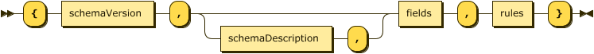
##### no references

## <a id="schemaVersion">schemaVersion:</a>
The DataHelix Profile version number will be in [Semantic Version](https://semver.org/) format with the patch level being optional.\

##### referenced by:
_**[profile](#profile)**_

## <a id="schemaDescription">schemaDescription:</a>
This is a free text field which can be used to describe what data the profile is modelling\
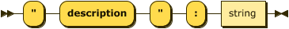
##### referenced by:
_**[profile](#profile)**_

## <a id="fields">fields:</a>
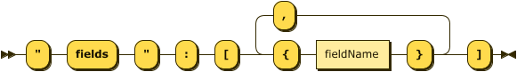
##### referenced by:
_**[profile](#profile)**_

## <a id="fieldName">fieldName:</a>
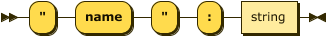
##### referenced by:
_**[fields](#fields)**_

## <a id="rules">rules:</a>
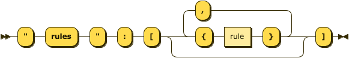
##### referenced by:</a>
_**[profile](#profile)**_

## <a id="rule">rule:</a>
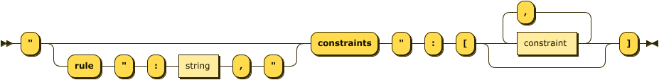
##### referenced by:</a>
_**[rules](#rules)**_

## <a id="constraint">constraint:</a>
Constraints are described in more detail in the following documents:
 * [EpistemicConstraints.md](EpistemicConstraints.md)
 * [GrammaticalConstraints.md](GrammaticalConstraints.md)
 * [PresentationalConstraints.md](PresentationalConstraints.md)
 
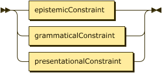
##### referenced by:
_**[rule](#rule)**_\
_**[not](#not)**_\
_**[anyOf](#anyOf)**_\
_**[allOf](#allOf)**_\
_**[if](#if)**_

## <a id="grammaticalConstraint">grammaticalConstraint:</a>

##### referenced by:
_**[constraint](#constraint)**_

## <a id="presentationalConstraint">presentationalConstraint:</a>

##### referenced by:
_**[constraint](#constraint)**_

## <a id="epistemicConstraint">epistemicConstraint:</a>
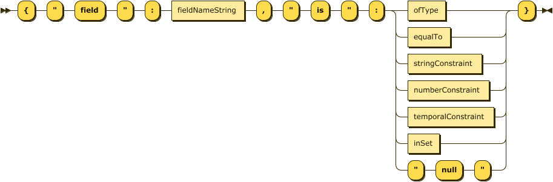
##### referenced by:
_**[constraint](#constraint)**_

## <a id="not">not:</a>

##### referenced by:
_**[grammaticalConstraint](#grammaticalConstraint)**_

## <a id="anyOf">anyOf:</a>
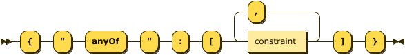
##### referenced by:
_**[grammaticalConstraint](#grammaticalConstraint)**_

## <a id="allOf">allOf:</a>
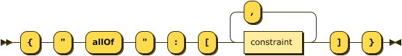
##### referenced by:
_**[grammaticalConstraint](#grammaticalConstraint)**_

## <a id="if">if:</a>

##### referenced by:
_**[grammaticalConstraint](#grammaticalConstraint)**_

## <a id="ofType">ofType:</a>
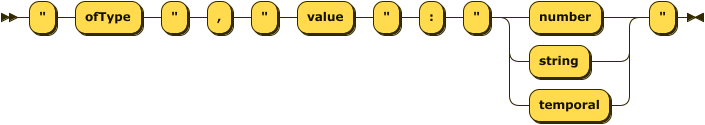
##### referenced by:
_**[epistemicConstraint](#epistemicConstraint)**_

## <a id="stringConstraint">stringConstraint:</a>
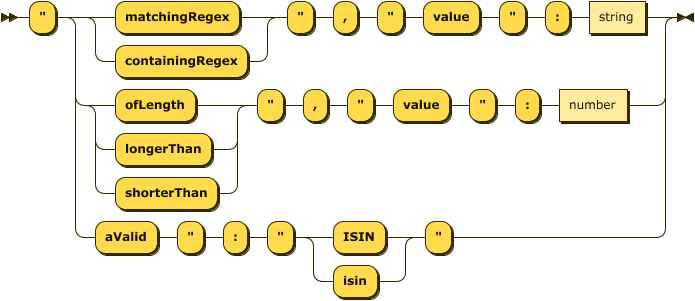
##### referenced by:
_**[epistemicConstraint](#epistemicConstraint)**_

## <a id="numberConstraint">numberConstraint:</a>
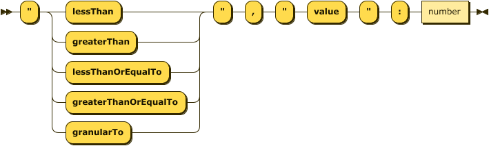
##### referenced by:
_**[epistemicConstraint](#epistemicConstraint)**_

## <a id="datetimeConstraint">datetimeConstraint:</a>
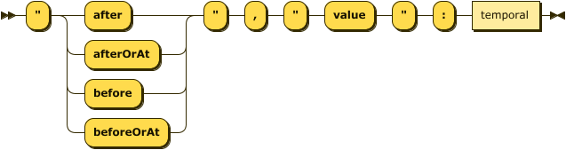
##### referenced by:
_**[epistemicConstraint](#epistemicConstraint)**_

## <a id="inSet">inSet:</a>
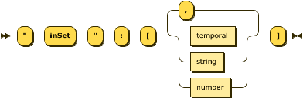
##### referenced by:
_**[epistemicConstraint](#epistemicConstraint)**_

## <a id="equalTo">equalTo:</a>
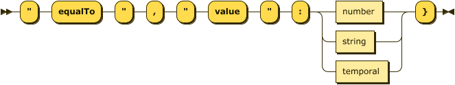
##### referenced by:
_**[epistemicConstraint](#epistemicConstraint)**_

## <a id="formattedAs">formattedAs:</a>

##### referenced by:
_**[presentationalConstraint](#presentationalConstraint)**_

## <a id="datetime">datetime:</a>

##### referenced by:
_**[equalTo](#equalTo)**_\
_**[inSet](#inSet)**_\
_**[datetimeConstraint](#datetimeConstraint)**_

## <a id="datetimeValue">datetimeValue:</a>
A datetime value is a representation of an
[ISO 8601-1:2019](https://www.iso.org/standard/70907.html)
formatted date time.\
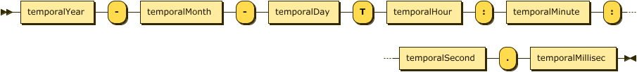
##### referenced by:num
_**[datetime](#datetime)**_

## datetimeYear:
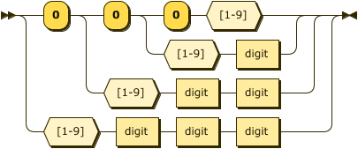
##### referenced by:
_**[datetimeValue](#datetimeValue)**_

## datetimeMonth:

##### referenced by:
_**[datetimeValue](#datetimeValue)**_

## datetimeDay:
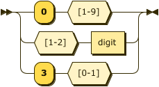
##### referenced by:
_**[datetimeValue](#datetimeValue)**_

## datetimeHour:
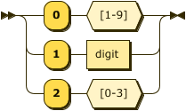
##### referenced by:
_**[datetimeValue](#datetimeValue)**_

## datetimeMinute:

##### referenced by:
_**[datetimeValue](#datetimeValue)**_

## datetimeSecond:
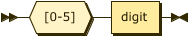
##### referenced by:
_**[datetimeValue](#datetimeValue)**_

## datetimeMillisec:

##### referenced by:
_**[datetimeValue](#datetimeValue)**_

## <a id="string">string:</a>
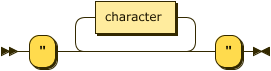
##### referenced by:
_**[equalTo](#equalTo)**_\
_**[fieldNameString](#fieldNameString)**_\
_**[inSet](#inSet)**_\
_**[ruleDescription](#ruleDescription)**_\
_**[schemaDescription](#schemaDescription)**_\
_**[stringConstraint](#stringConstraint)**_\

## <a id="stringFormatPattern">stringFormatPattern:</a>

##### referenced by:
_**[formattedAs](#formattedAs)**_

## <a id="character">character:</a>
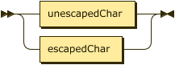
##### referenced by:
_**[stringFormatPattern](#stringFormatPattern)**_\
_**[string](#string)**_

## unescapedChar:
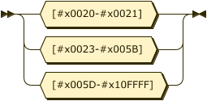
##### referenced by:
_**[character](#character)**_

## escapedChar:
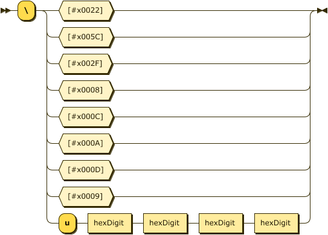
##### referenced by:
_**[character](#character)**_

## <a id="hexDigit">hexDigit:</a>
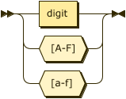
##### referenced by:
_**[escapedChar](#escapedChar)**_

## <a id="number">number:</a>
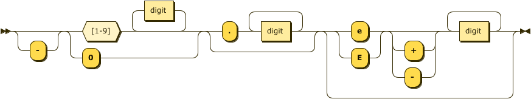
##### referenced by:
_**[equalTo](#equalTo)**_\
_**[inSet](#inSet)**_\
_**[numberConstraint](#numberConstraint)**_\
_**[stringConstraint](#stringConstraint)**_

## <a id="digit">digit:</a>
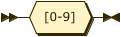
##### referenced by:
_**[hexDigit](#hexDigit)**_\
_**[number](#number)**_\
_**[schemaVersion](#schemaVersion)**_\
_**[datetimeDay](#datetimeDay)**_\
_**[datetimeHour](#datetimeHour)**_\
_**[datetimeMillisec](#datetimeMillisec)**_\
_**[datetimeMinute](#datetimeMinute)**_\
_**[datetimeMonth](#datetimeMonth)**_\
_**[datetimeSecond](#datetimeSecond)**_\
_**[datetimeYear](#datetimeYear)**_
