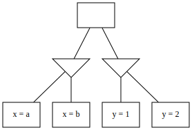
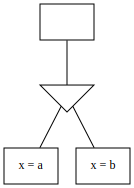
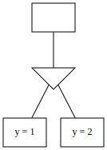
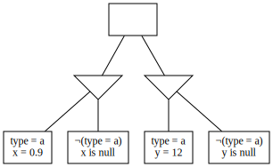
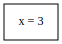
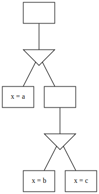

# Decision tree optimisation

## Partitioning

The expression of a field may depend on the expression of other fields. For instance, given `X = 3 OR Y = 5`, `Y` must be `5` if `X` is not `3`; `X` and `Y` can be said to _co-vary_. This covariance property is transitive; if `X` and `Y` co-vary and `Y` and `Z` co-vary, then `X` and `Z` also co-vary. Given this definition, it's usually possible to divide a profile's fields into smaller groups of fields that co-vary. This process is called **partitioning**.

For example, given the below tree:

We can observe that variations in `x` and `y` have no implications on one another, and divide into two trees:

 

The motivation for partitioning is to determine which fields can vary independently of each other so that streams of values can be generated for them independently (and potentially in parallel execution threads) and then recombined by any preferred [combination strategy](../../user/CombinationStrategies.md).

## Unification

Consider the below tree:

It's impossible to [partition](#Partitioning) this tree because the `type` field affects every decision node. However, we can see that the below tree is equivalent:  

Formally: If you can identify pairs of sibling, equivalent-valency decision nodes A and B such that for each constraint node in A, there is precisely one mutually satisfiable node in B, you can collapse the decisions. There may be multiple ways to do this; the ordering of combinations affects how extensively the tree can be reduced.

## Deletion

Consider the below tree:

Because the leftmost node contradicts the root node, we can delete it. Thereafter, we can pull the content of the other constraint node up to the root node. However, because `¬(x > 12)` is entailed by `x = 3`, we delete it as well. This yields:

## Hoisting

Consider the below tree:

We can simplify to:

Formally: If a Decision Node `D` contains a Constraint Node `C` with no constraints and a single Decision Node `E`, `E`'s Constraint Nodes can be added to `D` and `C` removed.

This optimisation addresses situations where, for example, an `anyOf` constraint is nested directly inside another `anyOf` constraint.
