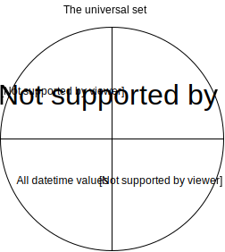

# Set restriction process

The profile describes to the generator how to reduce the original set of data to a permitted set of data per field. In most cases the generator starts off using the universal set as the source of data. This represents all values for all types (datetime, string, integer, decimal) without restriction. It also allows for no value to be emitted - the empty set (&#8709;) commonly expressed as `null`).

The universal set can be visualised as  


The generator will only (effectively) use a different original set of data - i.e. not use the universal set - if one of the following constraints are used:
* `equalTo` - uses the given value and &#8709;* as the set
* `inSet` - uses the given values and &#8709;* as the entire set
* `null` - uses the empty set (&#8709;) as the set of permitted values

\* Unless `not(field is null)` is supplied as a constraint to the field.

The above constraints describe the set of permitted values to then (potentially) filter values further (if there are more constraints).

You can imagine the universal set is divided into a number of quadrants, where each constraint only applies a filter to part of the universal set (or what remains of it). i.e.
* `greaterThan` will only affect the integer/decimal values in the universal set, other values will remain un-touched
* `shorterThan` will only affect the string values in the universal set, other values will remain un-touched
* `ofType` will remove all values from the universal set other than those of the prescribed type (see [graphical representation](images/set-reduction-ofType-string.svg))
* `not null` will remove the empty set (&#8709;) from the universal set (see [graphical representation](images/set-reduction-not-null.svg))
* `null` will remove everything except for the empty set (&#8709;) from the universal set  (see [graphical representation](images/set-reduction-null.svg))
* `inSet` removes any value from the universal set that is not in the prescribed set (set intersection) (except &#8709; which remains unless `not null` is used as well) (see [graphical representation](images/set-reduction-inSet-abc.svg))

## Examples:

### Numeric restrictions
```
foo greaterThan 2
and
foo lessThan 5
```
effectively:
1. Uses the universal set as the source of all data
1. Where a value is a number, ensures that it is _greater than_ 2 **AND** that it is _less than_ 5 (i.e. 2.00 _recurring_ - 1...4.99 _recurring_) _(yielding the set [{numbers \>2..\<5}, {all datetimes}, {all strings}, &#8709;])_

This reduced set of values is then the permitted set of values for field _foo_.

It does **not**
* Restrict any other type of value, therefore other types of values are still permitted (string, datetime)
* Prevent the empty set from being emitted

#### You might expect the following data to be emitted
| foo | 
| ---- |
| 3 |
| 4 |
| "some string" |
| 2010-01-01T01:01:01.000 |
| &#8709; |

### InSet restrictions

```
foo inSet [a, b, c]
and
foo inSet [c, d, e]
```

effectively:
1. Intersects the set [a, b, c] with the universal set _(yielding the set [a, b, c, &#8709;])_
1. Intersects [a, b, c] with [c, d, e] _(yielding the set [c, &#8709;])_

This set of values is then the permitted set of values for field _foo_.

It does **not**
* Prevent the empty set from being emitted

As the original set is a restricted set, only the values provided can be emitted. These values can be of heterogeneous types (e.g. an intermix of datetime, string, decimal and integer types).

#### You might expect the following data to be emitted
| foo | 
| ---- |
| c |
| &#8709; |

### Removal of the empty set (null)

```
foo inSet [a, b, c]
and
foo not(is null)
```

effectively:
1. Intersects the set [a, b, c] with the universal set _(yielding the set [a, b, c, &#8709;])_
1. Removes* the empty set _(yielding the set [a, b, c])_

\* In practice the set is not removed, an flag is set to instruct the generator to NOT emit the empty set (null) value

This set of values is then the permitted set of values for field _foo_.

#### You might expect the following data to be emitted
| foo | 
| ---- |
| a |
| b |
| c | 

### Contradicting sets

```
foo inSet [a, b, c]
and
foo equalTo [d]
```

effectively:
1. Intersects the set [a, b, c] with the universal set _(yielding the set [a, b, c, &#8709;])_
1. Intersects [a, b, c] with [d] _(yielding the set [&#8709;])_

This set of values is then the permitted set of values for field _foo_.

#### You might expect the following data to be emitted
| foo | 
| ---- |
| &#8709; |

### Conditionals (anyOf, allOf, if)

```
foo inSet [a, b, c, x, y, z]
if foo inSet [a, b, c]
then
bar equalTo [d]
else
bar equalTo [e]
```

Note that if the `else` is not supplied, it will be inferred as `not(bar equalTo [d])`, see the `not` section lower down.

effectively:
1. Intersects the set [a, b, c, x, y, z] with the universal set _(yielding the set [a, b, c, x, y, z, &#8709;])_
1. Splits the set into 2 discrete sets (_[a, b, c, &#8709;]_ and _[x, y, z, &#8709;]_) for field `foo`
1. For the first set of data for `foo` (_[a, b, c, &#8709;]_) intersect the set [d] with the universal set _(yielding the set [d, &#8709;])_ for field `bar`
1. Depending on the combination strategy, repeat each item in the set [d, &#8709;] with each item in the set [a, b, c, &#8709;] (the cartesian product)
1. Repeat the process for the second set where `foo` is has the set [x, y, z, &#8709;]

This set of values is then the permitted set of values for field _foo_.

#### You might expect the following data to be emitted
| foo | bar |
| ---- | ---- |
| &#8709; | &#8709; |
| &#8709; | e |
| x | &#8709; |
| y | &#8709; |
| z | &#8709; |
| x | e |
| y | e |
| z | e |
| a | &#8709; |
| b | &#8709; |
| c | &#8709; |
| a | d |
| b | d |
| c | d |

### Contradicting conditionals (_mistakes_)
```
bar not null
bar inSet [x, y, z]
foo inSet [a, b, c]
if foo inSet [a, b, c]
then
bar is null
```

The `else` segment has been excluded for clarity, it would be included as `not(foo inSet [a, b, c])` and processed as described in the section above.

effectively (in the ):
1. Remove the set [&#8709;] from the universal set and use this is the set for bar going forwards
1. Intersects the set [a, b, c] with the universal set _(yielding the set [a, b, c, &#8709;])_
1. For the first set of data for `foo` (_[a, b, c, &#8709;]_) intersect the set [&#8709;] with the set of data for `bar` _([{all datetimes}, {all numeric values}, {all string values}])_ this produces an empty set of data (where event the &#8709; is not present, i.e. [])

This results in no data being created given the scenario where foo has a value in the set _[a, b, c]_. The field `foo` is not restricted from being `null` therefore it is theoretically permitted for the generator to enter the _then_ when `foo` is `null`. This doesn't happen currently as when `foo` is `null` it is ambiguous between the _then_ and the _else_.

#### You might expect the following data to be emitted (where foo is not in the set [a, b, c])
| foo | bar |
| ---- | ---- |
| &#8709; | x |
| &#8709; | y |
| &#8709; | z |


### Negation of constraints

The `not` constraint inverts the operation of the constraint, so the following can be observed:

| constraint | effectively | resulting in |
| ---- | ---- | ---- |
| `foo is null` | intersects the universal set with [&#8709;] | [&#8709;] |
| `not(foo is null)` | removes [&#8709;] from the universal set | [{all values except: &#8709;}] |
| |
| `foo inSet [a, b, c]` | intersects the universal set with [a, b, c]* | [a, b, c, &#8709;] |
| `not(foo inSet [a, b, c])` | removes [a, b, c] from the universal set | [{all values except: a, b or c}] |

\* Note, the intersection retains the applicability of the &#8709; being emitted. The only way to remove the &#8709; from the set of permitted values is to use the `not (foo is null)` constraint.
